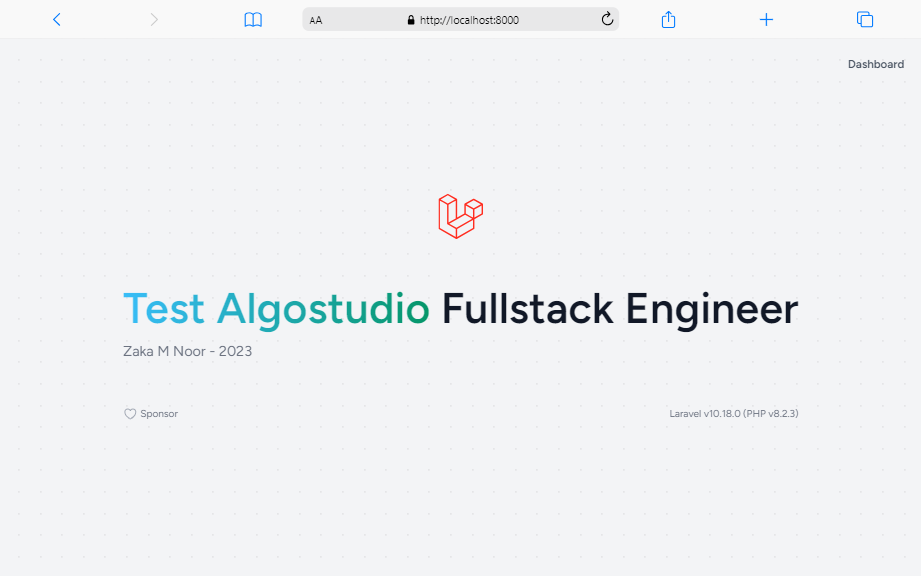
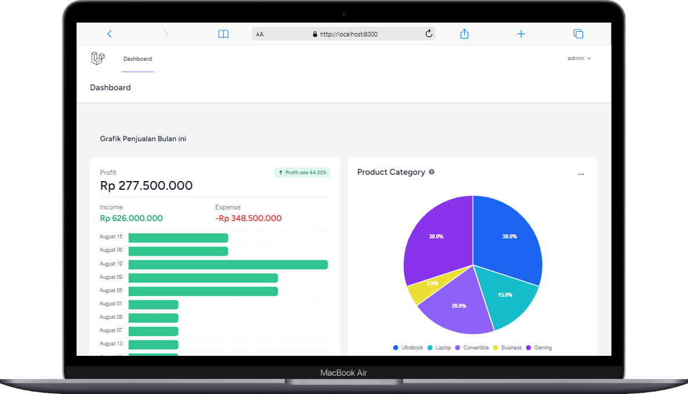
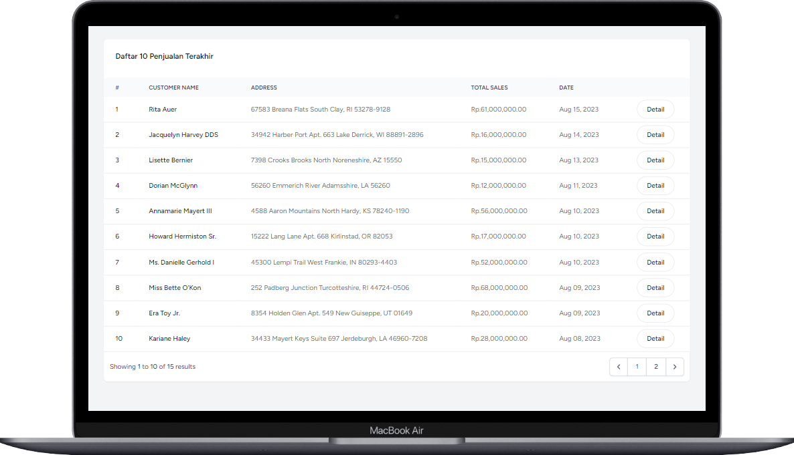
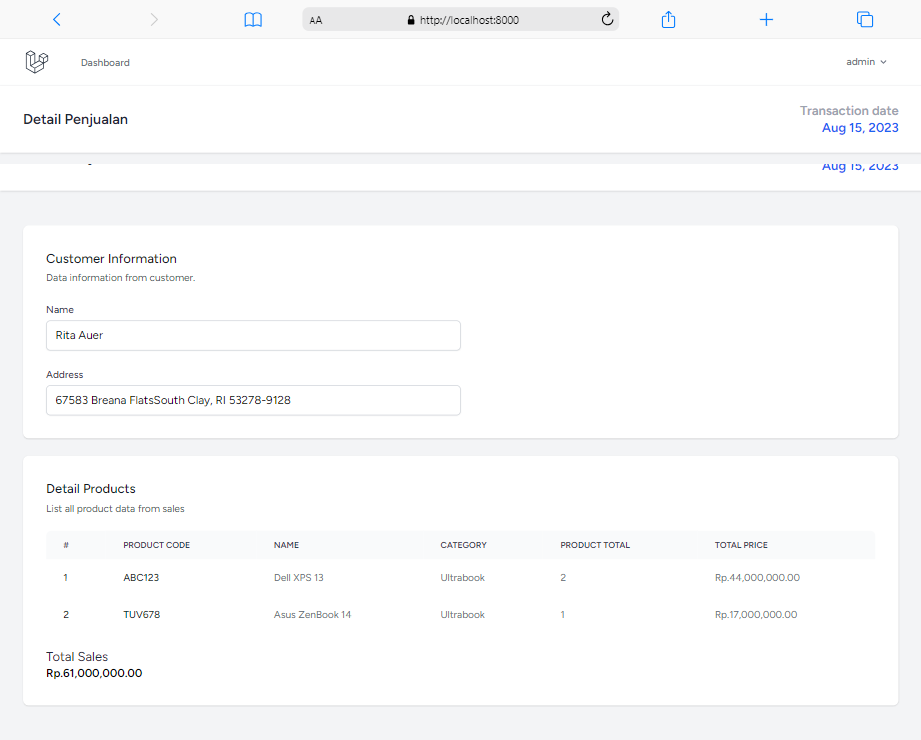
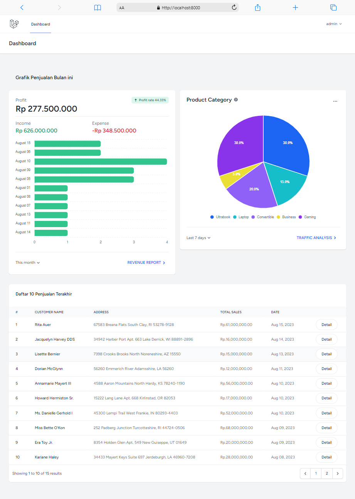

# Test Algostudio - Fullstack Engineer

Web based application [Computer Sales](https://docs.google.com/document/d/1SZz7pRIynFnfIAzbELjTJHNlNnqOj3VV/edit). Build with Laravel
## Getting Started

These instructions will give you a copy of the project up and running on
your local machine for development and testing purposes. See deployment
for notes on deploying the project on a live system.

### Prerequisites

Requirements for the software and other tools to build, test and push 
- PHP Version 8 or above
- Composer
- npm or yarn
- MySQL

### Installing

A step by step series of examples that tell you how to get a development
environment running

clone this project

    git clone https://github.com/ZakaCoding/test-algostudio.git

Install project on your local computer

    composer install

Install depedencies

    npm install

After all depedencies installed, create new database

    mysql create database fs_algostudio

copy or rename file `.env.example` as `.env`

please adjust DB_DATABASE,DB_NAME,DB_PASSWORD with your database configuration

generate laravel key

    php artisan key:generate

Run migrations and seed

    php artisan migrate --seed

## Deployment

Run project with laravel artisan

    php artisan serve

and opened on web browser

    http://localhost:8000/

## Running the tests

For using this web application you need to have access. below this list all users.

### Admin
| Email  | Password |
| ------------- | ------------- |
| admin@admin.com  | pwd-admin1  |

### Sample Tests

This simple manual book for operating this web application

#### Admin Dashboard
On this page only show dummy data from sales computer and not have CRUD system, except on Login and Register.

#### Screenshot

## Authors

  - **Zaka M Noor** - *Full stack web developer*
  - [ZakaCoding](https://zakacoding.github.io)

See also my latest project
[open-cmap](https://open-cmap.fly.dev)
## Acknowledgments

  - Thanks to algostudio to allow me with this test project
